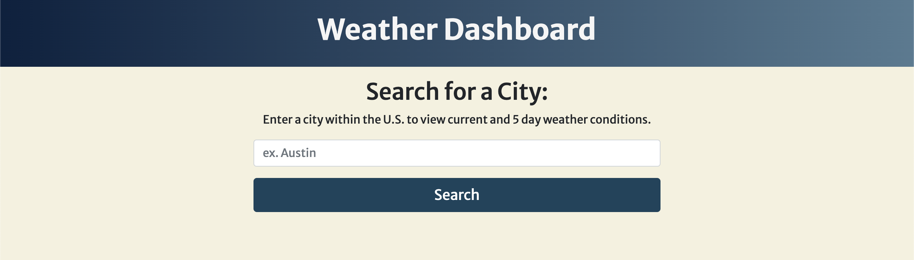

# Weather Dashboard

## Description

Weather Dashboard is a simple application that utilizes a weather API to easily provide a user with the current and 5 day forecasts based on a city location.


[Deployed application](https://jessvarghese.github.io/weather_dashboard/)

## Table of Contents

 * [Description](#description)
 * [Table of Contents](#table-of-contents)
 * [Installation](#installation)
 * [Technologies](#technologies)
 * [Usage](#usage)
 * [License](#license)


## Installation

```
gh repo clone JessVarghese/weather_dashboard

```


## Technologies

* [jQuery](https://jquery.com/)
* [Moment.js](https://momentjs.com/docs/)
* [Bulma](https://bulma.io/)
* [OpenWeather](https://openweathermap.org/api)


## Usage





  ## License
  This project operates under the [MIT](https://choosealicense.com/licenses/MIT/) license.
